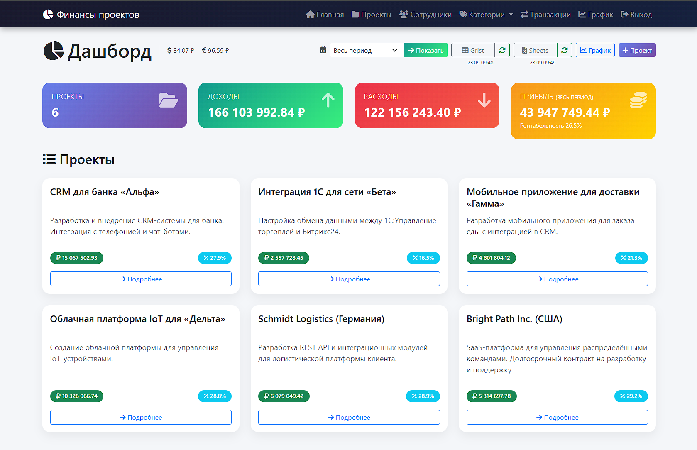
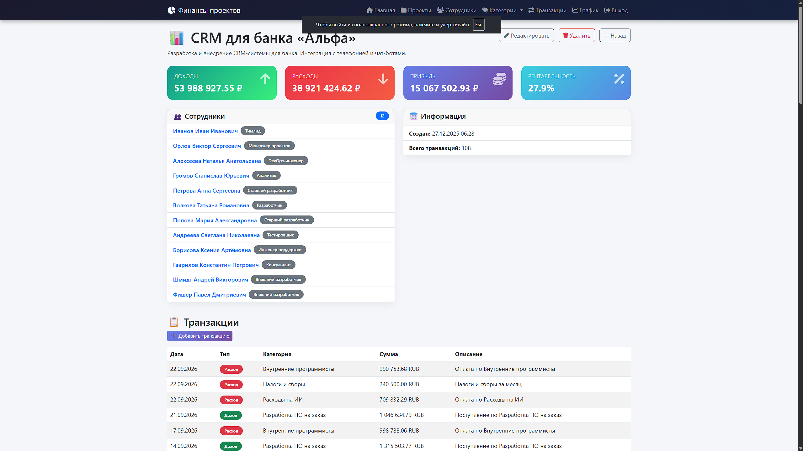
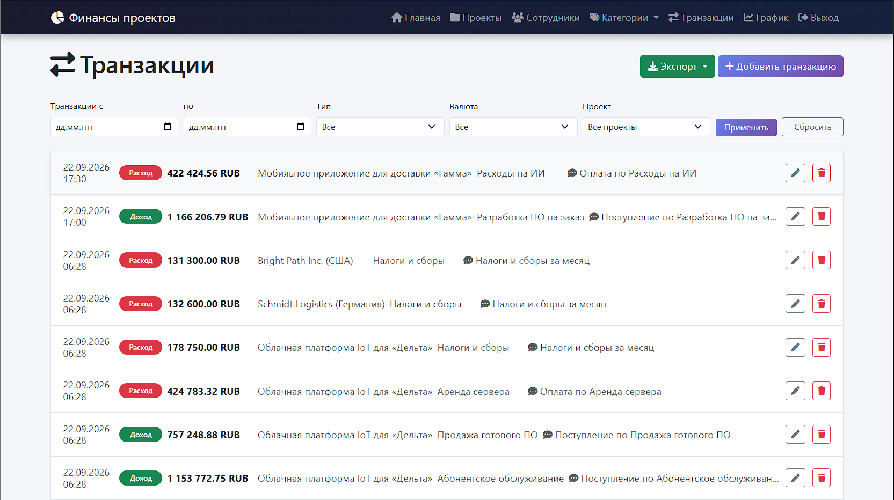
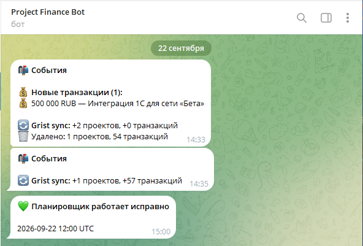
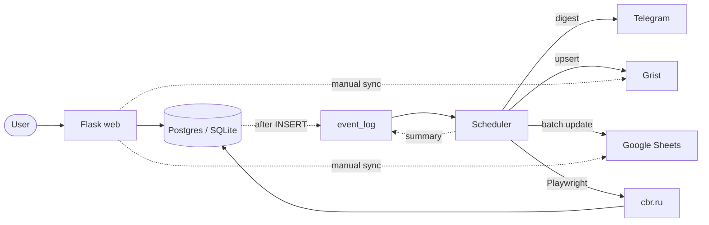

# 💰 Финансы проектов

Flask-приложение для учёта доходов и расходов по проектам: CRUD,
аналитика рентабельности, экспорт в CSV/Excel, синхронизация с Grist
и Google Sheets, event-driven уведомления в Telegram, планировщик фоновых задач.

**Live demo на Railway:** `https://project-finance-production-21.up.railway.app/`
Логин: `admin` / `admin`

**Скриншоты:**

| Дашборд | Карточка проекта |
|---|---|
|  |  |

| Транзакции с фильтрами | Telegram-уведомления |
|---|---|
|  |  |

**Ручная синхронизация интеграций из UI:**


## Возможности

- **CRUD** проектов, сотрудников (с ролями на проектах), категорий и транзакций. Роли: админ / пользователь.
- **Дашборд** с доходом, расходом, прибылью и рентабельностью за выбранный период.
- **Мультивалютность.** Транзакции в RUB / USD / EUR конвертируются в рубли по актуальному курсу ЦБ на дату.
- **Курсы ЦБ** парсятся с `cbr.ru` через Playwright (обход DDoS-Guard) и сохраняются в БД + Grist.
- **Экспорт** в CSV, XLSX (openpyxl) и синхронизация с Google Sheets с валидацией полей.
- **Grist** как витрина для команды: идемпотентный upsert с retry, chunking, prune удалённых записей.
- **Event-driven уведомления в Telegram** через очередь событий в БД и отдельный процесс-планировщик.
- **Ручная синхронизация** из UI с отображением статуса и времени последней синхронизации.
- **Security:** rate limiting на логин, security headers, sanitize секретов в логах, fail-fast на `SECRET_KEY`.

## Архитектура



**Ключевые принципы:**

- **Разделение процессов.** Web и scheduler — два независимых сервиса в одном деплое. Scheduler запускается отдельно от Flask, чтобы при нескольких воркерах gunicorn задачи не дублировались.
- **Event-driven.** Flask не вызывает Telegram напрямую — пишет событие в `event_log`, scheduler раз в 30 секунд выгребает pending и отправляет digest. Отказ Telegram не блокирует UX, события не теряются.
- **Идемпотентность.** Grist использует `PUT /records` с `require: {"ID2": id}`. Google Sheets перезаписывается целиком. Повторный запуск синхронизации обновляет, а не дублирует.
- **Устойчивость к сетевым сбоям.** Retry с экспоненциальным backoff (3 попытки, 1s → 2s → 4s) для Grist, chunking по 100 записей, sanitize трейсбеков перед отправкой в Telegram.
- **Гибкая конфигурация секретов.** Google credentials читаются из `GOOGLE_CREDENTIALS_B64` (base64 в env) с fallback на файл — работает и на Railway, и локально.

## Стек

| Слой | Технологии |
|---|---|
| Backend | Python 3.12, Flask, SQLAlchemy, Flask-Login, WTForms |
| БД | PostgreSQL (prod), SQLite (dev) |
| HTTP | httpx (async), requests |
| Browser | Playwright (Chromium) |
| Планировщик | APScheduler (AsyncIOScheduler) |
| Интеграции | Grist API, Google Sheets API, Telegram Bot API |
| UI | Bootstrap 5, Chart.js, Font Awesome |
| Экспорт | CSV (stdlib), XLSX (openpyxl) |
| Тесты | pytest, pytest-asyncio, pytest-cov, respx |
| Качество | ruff, mypy, pre-commit, gitleaks |
| Деплой | Docker, Railway |

## Быстрый старт

### Локально

```bash
git clone https://github.com/daniil-avdeenko/project-finance.git
cd project-finance
python -m venv .venv && source .venv/bin/activate   # Windows: .venv\Scripts\activate
pip install -r requirements.txt
playwright install chromium
cp .env.example .env                                 # заполнить переменные
flask db upgrade && python seed.py
python run.py                                        # http://127.0.0.1:5000
```

**Планировщик — отдельным терминалом:**

```bash
python -m scheduler.runner
```

### Docker

```bash
docker compose build
docker compose up -d
```

Поднимутся два контейнера: `pf-web` (порт 5000) и `pf-scheduler` (healthcheck на 8080).
Оба используют один образ, но разные команды запуска.

### Тесты

```bash
pytest
```

**235 тестов, coverage 87%.** Ключевые модули: `telegram.py` — 100%, `excel_export.py` — 100%,
`grist_httpx.py` — 94%, `sync_service.py` — 97%.

## Деплой на Railway

Проект развёрнут как **три сервиса** в одном Railway-проекте:

1. **PostgreSQL** — managed-база.
2. **web** — Docker-образ, gunicorn с 2 воркерами.
3. **scheduler** — тот же образ, но с командой `python -m scheduler.runner`.

**Переменные окружения** (для обоих сервисов):

```ini
SECRET_KEY=<32 байта hex>
FLASK_ENV=production
DATABASE_URL=${{Postgres.DATABASE_URL}}
GRIST_API_KEY=<ключ>
GRIST_DOC_ID=<ID документа>
GRIST_SERVER=https://docs.getgrist.com
TELEGRAM_BOT_TOKEN=<токен от @BotFather>
TELEGRAM_CHAT_ID=<ID чата>
GOOGLE_CREDENTIALS_B64=<credentials.json в base64>
GOOGLE_SPREADSHEET_ID=<ID таблицы>
EVENTS_ENABLED=true
RATELIMIT_ENABLED=true
```

Scheduler дополнительно: `HEALTHCHECK_ENABLED=true`, `HEALTHCHECK_PORT=8080`.

## CLI-команды

```bash
flask sync-grist-httpx    # Синхронизация с Grist
flask sync-sheets         # Синхронизация с Google Sheets
flask scrape-cbr          # Парсинг курсов ЦБ (Playwright)
flask send-test-message   # Тест Telegram-уведомлений
```

## Роли и seed-данные

После `python seed.py` создаются 6 проектов, 30 сотрудников с ролями на проектах,
и ~470 транзакций в RUB/USD/EUR.

- **Администратор:** `admin` / `admin` — полный доступ, ручная синхронизация, экспорт.
- **Пользователь:** `user` / `user` — просмотр, создание транзакций, экспорт.

## Структура

```
app/
├── models.py                  # SQLAlchemy-модели
├── events.py                  # SQLAlchemy listeners для event_log
├── forms.py, helpers.py       # WTForms, утилиты
├── routes/                    # CRUD-роуты по сущностям
├── integrations/
│   ├── grist_httpx.py         # Grist API: retry, chunking, prune
│   ├── google_sheets.py       # gspread + валидация + base64 credentials
│   ├── telegram.py            # Bot API, sanitize трейсбеков
│   └── cbr_scraper.py         # Playwright + обход DDoS-Guard
├── services/
│   ├── currency_service.py    # upsert курсов, конвертация
│   ├── project_stats.py       # расчёт показателей без N+1
│   ├── excel_export.py        # xlsx через openpyxl
│   └── sync_service.py        # SyncLog, короткие ошибки для UI
├── templates/, static/
└── security.py                # HTTP headers + sanitize секретов

scheduler/
├── jobs.py                    # process_events, sync_grist, scrape_cbr, sync_sheets
└── runner.py                  # точка входа APScheduler + healthcheck на :8080

migrations/versions/            # Alembic
tests/                          # 235 тестов
scripts/freeze.py, check_sheets.py
Dockerfile, docker-compose.yml, railway.toml
```

## Что планируется улучшить

- **Batch API для Google Sheets.** Сейчас синхронизация делает ~8 отдельных
  HTTP-запросов (clear + update + formatting на каждый лист). `batchUpdate`
  сожмёт их до 1–2 запросов, экономия ещё 3-5 секунд на синхронизацию.
- **Внешний uptime-мониторинг.** `/healthz` есть, но Railway сам решает,
  что делать при падении. Внешний сервис (Better Stack, UptimeRobot)
  с алертом в Telegram закрыл бы сценарий «упало ночью, узнали утром».
- **Гибкая система ролей и audit log.** Сейчас `admin` / `user` покрывают
  сценарии двух пользователей. С ростом команды понадобятся роли с
  разными правами и история действий.
- **Интерактивный Telegram-бот.** Сейчас бот только отправляет уведомления. Полезно добавить команды:
  - `/status` — время последней синхронизации, количество проектов и транзакций, курсы валют
  - `/sync` — ручной запуск синхронизации с Grist и Sheets из чата
  - `/report` — сводка за месяц по проектам

## Лицензия

MIT
