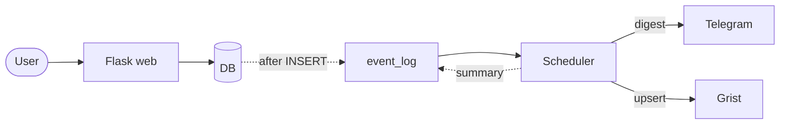

# 💰 Финансы проектов

Flask-приложение для учёта доходов и расходов по проектам: CRUD, аналитика
рентабельности, экспорт в CSV, синхронизация с Grist через upsert,
event-driven уведомления в Telegram по расписанию.

## Возможности

- CRUD проектов, сотрудников, категорий, транзакций (роли: админ / пользователь)
- Дашборд: доход, расход, прибыль, рентабельность в реальном времени
- График рентабельности по проектам за 6 месяцев (Chart.js)
- Фильтры транзакций по дате и типу, пагинация
- Экспорт в CSV (UTF-8 с BOM)
- Синхронизация с Grist через идемпотентный upsert
- Event-driven уведомления в Telegram через очередь событий
- Планировщик фоновых задач на APScheduler

## Архитектура



Flask не общается с Telegram напрямую — пишет событие в `event_log`, а отдельный
процесс-планировщик раз в 30 секунд выгребает pending и отправляет. Отказ Telegram
не влияет на работу приложения, события не теряются (retry до 3 раз).

## Стек

Python 3.11 · Flask · SQLAlchemy · SQLite/PostgreSQL · httpx · APScheduler · Grist API · Telegram Bot API · Bootstrap 5 · Chart.js
Тесты: pytest + respx · Качество: ruff, mypy, pre-commit, gitleaks

## Быстрый старт

```bash
git clone https://github.com/daniil-avdeenko/project-finance.git
cd project-finance
python -m venv .venv && source .venv/bin/activate   # Windows: .venv\Scripts\activate
pip install -r requirements.txt
cp .env.example .env                                 # заполнить переменные
flask db upgrade && python seed.py
python run.py                                        # http://127.0.0.1:5000
```

Планировщик — отдельным терминалом:

```bash
python -m scheduler.runner
```

Тесты:

```bash
pytest
```

## Переменные окружения

Полный список — в `.env.example`. Ключевые: `SECRET_KEY`, `DATABASE_URL`,
`GRIST_API_KEY`, `GRIST_DOC_ID`, `TELEGRAM_BOT_TOKEN`, `TELEGRAM_CHAT_ID`.

## CLI

```bash
flask sync-grist-httpx       # Синхронизация с Grist
flask scrape-cbr             # Курсы ЦБ через Playwright
flask send-test-message      # Проверка Telegram
```

## Пользователи (после seed)

- `admin` / `admin` — полный доступ
- `user` / `user` — просмотр, создание транзакций, экспорт

## Качество

- 95+ тестов, покрытие ключевых модулей 91–100%
- pre-commit: ruff, mypy, gitleaks, conventional commits
- Conventional Commits, feature-ветки, PR с ревью
